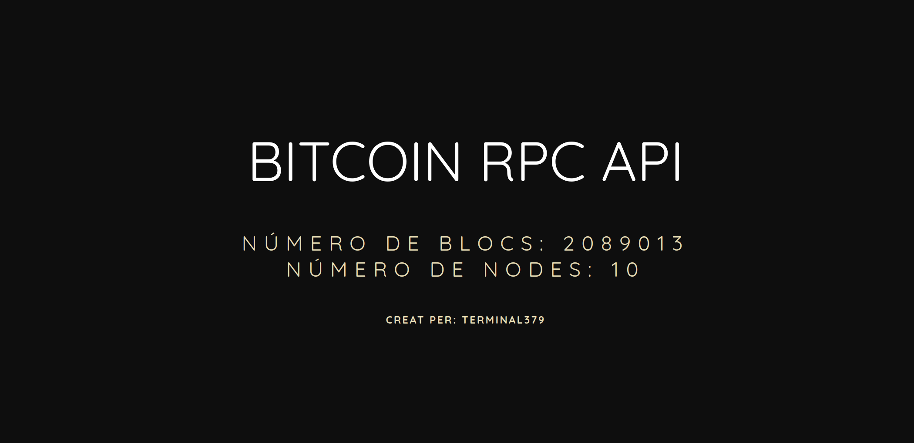
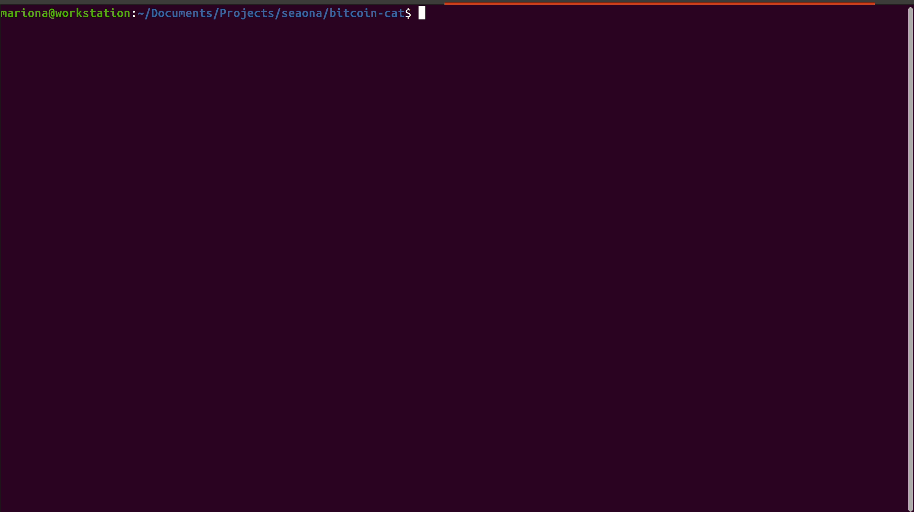
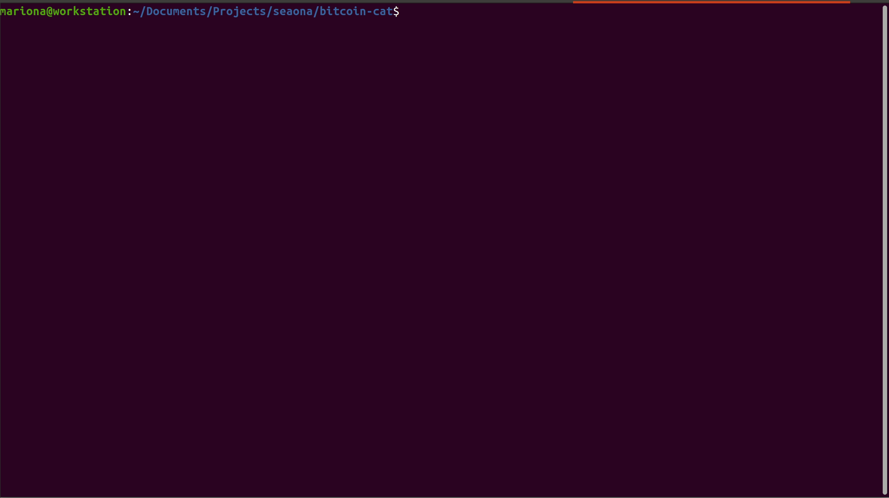

# Intro
This project shows how to create a backend API with the RPC reference methods for Bitcoin, as well as running bitcoind and connect it to a frontend with React.

The final result is the following:

## Bitcoind
For running bitcoin daemon simply go to your bitcoin core folder bitcoin/bin and run the command ``bitcoind``.

You will need to configure the file ``bitcoin/bitcoin.conf`` and include the information for the RPC connection, as well as activate the test mode:

> testnet=1
>
> rpcuser=bitcoinuser
>
> rpcpassword=bitcoinpassword

Sample:

## Api
For running the server simply cd to the api folder and start the server:
> cd bitcoin-api
>
> npm run start
>

Sample:

## Frontend
Frontend is build from the base script ``create-react-app``. For running the frontend cd to the frontend folder and start the frontend:

> cd bitcoin-frontend
>
> npm run start
>

Sample:
